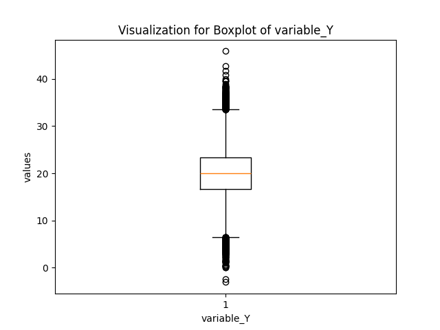

# Cindy_Gao_Matrix_Build

- .devcontainer: It sets up a consistent development environment across different machines.
- .github/workflows: It defines automated workflows for CI/CD tasks.
- Makefile: It manages tasks like installing dependencies, formatting code, linting, and testing- requirements.txt.
- requirements: Lists the Python packages required by the project.
- main.py: Contains the main code and functions for the project.
- Boxplot.png: A data visualization of boxplot for variable Y.
- Boxplot.md: A markdown for the boxplot image, and the mean, median and standard deviation calculation.
- test_main.py: Contains test cases for main.py.
- summary_test_report.pdf: A pdf containing summary of the results of the test functions and the boxplot image.
- README.md: Provides documentation and their information for the project.

# Purpose for this project:
1. Set up a Gitlab Actions workflow
2. Test across at least 3 different Python versions   
The Github Action results:

# Url to the raw data:
data = "https://raw.githubusercontent.com/anlane611/datasets/main/population.csv"

# Statistic Summary for the data:

# Below is the boxplot for variable Y:

